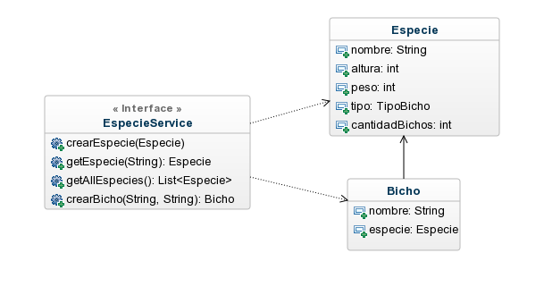
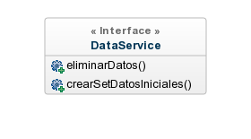

## Entrega 1 - JDBC

¡Es necesario empezar a modelar los bichomones! La prioridad es tener un módulo de administración donde puedan configurarse las especies de bichos que existen con sus propiedades básicas (nombre, peso, altura, tipo) y donde puedan crearse nuevos bichos pertenecientes a cada especie.

El líder del equipo de frontend se reúne con nosotros y nos muestra una interfaz:

Nos comenta que su equipo ya se encuentra bastante adelantado, llevan trabajando semanas contra una implementación mock de dicha interfaz y ya tienen la ui casi lista, pero es hora de hacer una implementación verdadera para dicho servicio. Obviamente no podemos modificar la interfaz `EspecieService` porque eso causaría incompatibilidades entre ambos equipos.

La interfaz `EspecieService` declara los siguientes métodos que nosotros debemos implementar:

- `void crearEspecie(Especie especie)` - este método será utilizado por una interfaz de administración para crear nuevas especies de bichos, recibe un objeto `Especie` previamente construido por la gente de frontend y se encarga de persistirlo en la base de datos.  Tener en cuenta que el nombre de cada especie debe ser único para toda la aplicación.

- `Especie getEspecie(String nombreEspecie)` - este método devolverá la `Especie` cuyo nombre sea igual al provisto por parámetro.  Se espera que este método devuelva, a lo sumo, un solo resultado.  En caso de no encontrar ninguna especie se espera que arroje la excepción `EspecieNoExistente` (no chequeada).

- `List<Especie> getAllEspecies()` - este método deberá devolver una lista de todas las especies existentes ordenadas alfabéticamente por su nombre en forma ascendente.

- `Bicho crearBicho(String nombreEspecie, String nombreBicho)` - crea un nuevo `Bicho` perteneciente a la especie especificada. El nuevo objeto `Bicho` no es persistido (de momento), solo devuelto. Para llevar una mejor estadística de los bichos que han sido creados cada especie cuenta con un contador cantidadBichos. El mismo deberá ser incrementado en 1.

Adicionalmente, el equipo de frontend ha realizado unos tests de integración que tienen como fin comprobar que nuestro `EspecieService` funciona como ellos esperan.  En dichos tests ellos están haciendo uso de la siguiente interfaz, para la cual también deberemos proveer una implementación:

La interfaz `DataService` entiende dos mensajes:

- `void deleteAll()` - se espera que tras ejecutarse esto se elimine toda la información persistida en la base de datos, de manera de poder comenzar el siguiente tests desde cero.

- `void crearSetDatosIniciales()` - crea un set de datos iniciales (de momento solo objetos `Especie`) para facilitar las pruebas de frontend.

### Se pide:
- Que provean implementaciones para las interfaces descriptas anteriormente, haciendo uso de todo lo visto en clase.
- Asignen propiamente las responsabilidades a todos los objetos intervinientes, discriminando entre servicios, DAOs y objetos de negocio.
- Creen test unitarios para cada unidad de código entregada que prueben todas las funcionalidades pedidas, con casos favorables y desfavorables.
- Provean un archivo .sql con las sentencias DDL que sean necesarias para crear el schema de la base de datos (create tables).

### Recuerden que:
- No pueden modificar las interfaces `EspecieService` y `DataService`, solo implementarlas.
- Pueden agregar nuevos métodos y atributos a los objetos `Especie` y `Bicho`, pero no eliminar o renombrar atributos / métodos ya provistos.
- Se considerará a un TP como entregado solo cuando tenga implementada toda la funcionalidad que se pide para la entrega.
- Se evaluará no solo que el TP cumpla con todos los requisitos, sino la calidad del mismo (buen diseño, simplicidad, buena distribución de responsabilidades, prolijidad del código, código no repetido, etc)
